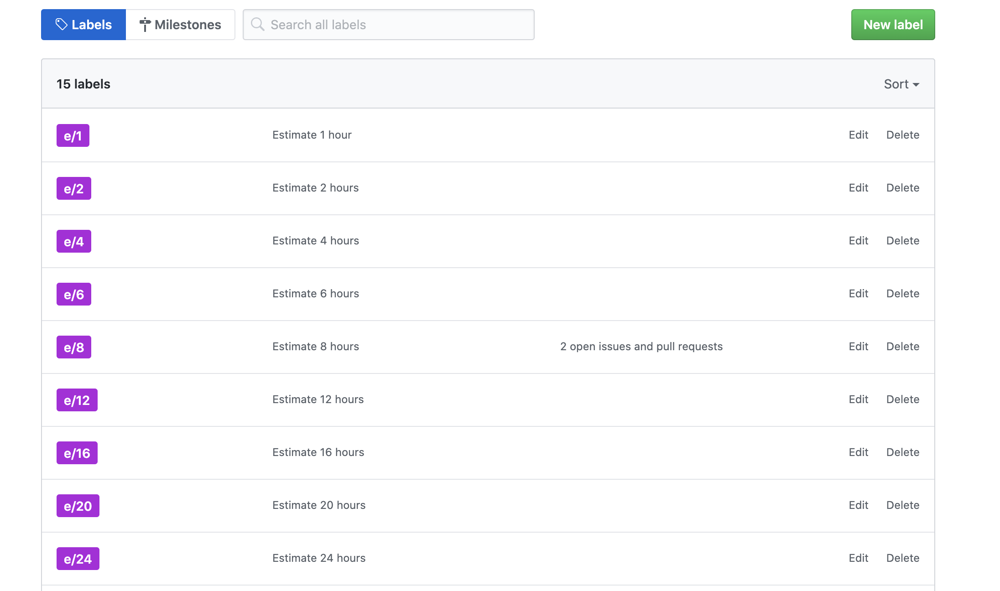

# Issues Hub
Is a [chrome extension](https://chrome.google.com/webstore/detail/issues-hub/gjpcbkmnpfnpmghmiohfcbhckigmloic) to add github issues the estimate capabilities.

# Steps to use:
 - Add labels to repositories with name `e/[num]`
 - Asign labels to issues
 - enjoy

# My labels

## About this Fork

I hacked the original extension because it didn't work the way I wanted it to. That's all there is to this.

What changed? Not a lot:

* Instead of the inane ``e/<time>`` label format, any issue label prefixed with ``Estimate:`` will now be counted. Feel free to modify this in the pattern and CSS
* Instead of renaming the issue label itself, no change to the issue label buttons is made. This ensured consistency with the default UI
* The estimated completion time will be displayed at the top of each column in the following format: "X minutes (X/60 Hours)"
* I updated the name and description of the extension to make it easier to understand and differ from the original in the extensions panel
* Removed the spammy console output (though the ``setInterval`` I didn't bother to remove, even if it annoys me greatly)
* Add experimental support for fractions (this might break in some edge cases, though I haven't encountered any)

This is how it currently looks for me:

The UI can likely be improved further, but for the time being I haven't bothered.

## Installing this Fork

Since it's not published anywhere else, you must install it manually to use this version:

1. Open ``chrome://extensions`` in a new tab
2. Enable developer mode (slider to the top right as of the time of writing)
3. Click "load unpacked" and select the folder where the extension code (``manifest.json`` at the root level) is located

Instead of the arbitrary amounts of time given in the example above, I recommend using a more readable format. I personally use "minutes", so instead of ``e/1`` the issue label will be called ``Estimate: 120 minutes`` and this adds ``120 min (2 hours)`` as the summary text.

## Contributing

If you want to add onto this or find a problem, feel free to open an issue. I can't promise I'll have time to do much, but at least I'll generally respond to queries (unlike the original author) :P

## Using it on Firefox

I've managed to make it load the extension by doing the following:

1. Open ``about:debugging``
2. Go to ``This Firefox``
3. Click ``Load Temporary Add-on``
4. Select the ``manifest.json`` file

Unfortunately I was unable to load it permanently via the regular addons menu, as Firefox claims the file is corrupted. No idea what's wrong with it, but I didn't want to spend any more time on it.
